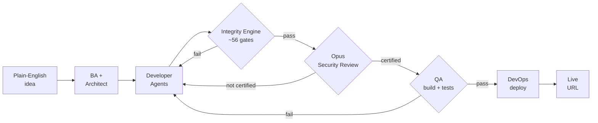
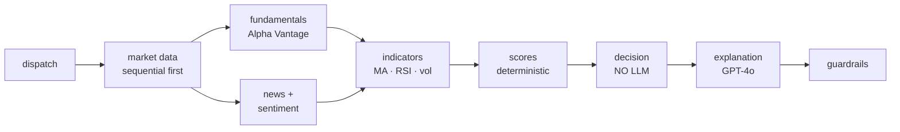
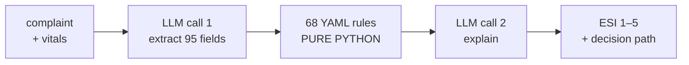

<div align="center">


# Raj Kumar Nelluri

### AI Engineer · LLM Systems · Multi-Agent Architecture · Production Deployment

<b>B.Tech Artificial Intelligence</b> — Amrita Vishwa Vidyapeetham &nbsp;·&nbsp; <b>MS Computer Science</b> — Pace University, New York

[](https://rajkumarai.dev)

## *I build AI systems where the model is never the single point of failure.*

Every system on this page puts a **deterministic engine in front of the LLM.**<br/>
Rules decide. The model explains. That is the difference between a demo and something you can deploy.


<br/>

[](https://rajkumarai.dev)
[](https://www.linkedin.com/in/raj-kumar-nelluri-351389393/)
[](mailto:rajkumarn2002@gmail.com)
[](https://rajkumarai.dev/Raj_Kumar_Nelluri_AI:ML_Engineer.pdf)


</div>

---

<div align="center">

## Systems Running In Production

| | System | What It Does | Live |
|:--:|:--|:--|:--:|
| 🧠 | **[ai-org](https://github.com/Rajkumar2002-Rk/ai-org)** | Autonomous multi-agent org that ships a security-certified full-stack app from one sentence | `self-hosted` |
| 📈 | **[Fintel](https://github.com/Rajkumar2002-Rk/financial-research-agent)** | 9-node LangGraph agent → deterministic BUY/HOLD/SELL in under 30s | [](https://fintel.rajkumarai.dev) |
| 🎬 | **[CineNeuro](https://github.com/Rajkumar2002-Rk/CineNeuro)** | Predicts a human audience's brain response to a trailer before anyone watches it | [](https://cineneuro.rajkumarai.dev) |
| 🏥 | **[MedEval](https://github.com/Rajkumar2002-Rk/MedEval)** | ER triage assistant where 68 clinical rules — not the LLM — assign urgency | [](https://medeval.rajkumarai.dev) |
| 📚 | **[RAG Chatbot](https://github.com/Rajkumar2002-Rk/rag-chatbot)** | Citation-grounded document QA that refuses to answer when context is thin | [](https://chatbot.rajkumarai.dev) |

<sub>All four public demos run on AWS EC2 behind Nginx + Let's Encrypt. Docker Compose, cross-built `linux/amd64`, pushed through Docker Hub.</sub>

</div>

---

## About Me

I'm an AI Engineer working on **LLM systems that survive contact with production** — multi-agent pipelines, agentic orchestration, retrieval, and the unglamorous infrastructure that keeps them honest.

The pattern in everything I build is the same: I don't let a language model make the decision that matters. In **Fintel** a deterministic scoring engine issues the BUY/HOLD/SELL and GPT-4o is only allowed to explain it. In **MedEval** a pure-Python rules engine assigns the ESI urgency level and the LLM is structurally barred from touching it. In **ai-org** roughly 56 deterministic integrity gates stand between generated code and a deploy, each one grounded in a real captured bug and locked with a regression test. The model is a component, not the architecture.

- **Agentic systems** — LangGraph `StateGraph` pipelines, fan-out/fan-in orchestration, typed state with reducers, conditional aborts, tool calling
- **Multi-agent engineering** — specialised agents for analysis, architecture, codegen, security review, QA and deploy, coordinated end to end without a human in the loop
- **Retrieval** — adaptive chunking, MMR + BM25 hybrid retrieval, score-based reranking, citation injection, confidence guardrails that refuse rather than hallucinate
- **Reliability engineering for LLM output** — deterministic gates, regression-locked fixes, hallucinated-import blocklists, self-healing rewrite loops, LLM-as-judge evaluation harnesses
- **Applied research** — Meta FAIR's TRIBE v2 brain-encoding model in a real product, with a fix contributed back upstream
- **Production infrastructure** — FastAPI, Docker multi-stage builds, AWS EC2, Nginx, Let's Encrypt, GitHub Actions CI, Redis, Postgres, Langfuse tracing

> *A model that doesn't reach production is a prototype. A model nobody can trust in production is a liability.*

---

## Numbers That Are Actually Measured

<div align="center">

| Metric | Result | System |
|:--|:--|:--|
| **Deterministic integrity gates** | **~56**, each grounded in a captured bug + locked by a regression test | ai-org |
| **Autonomous certified deploy** | Run **2081** — security reviewer found *and repaired* a live JWT-in-URL vuln | ai-org |
| **Under-triage rate** | **20% → 10%** after tuning, across a 50-case harness | MedEval |
| **Clinical rules, zero LLM in the decision** | **68** YAML rules across 4 tiers, all carrying a decision point | MedEval |
| **Neural prediction resolution** | **20,484** fMRI vertices per segment → 7 brain regions → 5 emotions | CineNeuro |
| **Cost displaced** | replaces a **$50K–$200K** studio focus group with a software pipeline | CineNeuro |
| **Investment report latency** | **< 30 seconds** end to end, 9-node LangGraph | Fintel |
| **Retrieval discipline** | MMR (λ=0.7) + hybrid BM25, reranked, **refuses below 0.15** confidence | RAG Chatbot |

</div>

---

# Featured Systems

---

## 🧠 ai-org — Autonomous AI Engineering Organization

**[Repository ↗](https://github.com/Rajkumar2002-Rk/ai-org)**

> *A multi-agent pipeline that turns a plain-English business idea into a deployed, security-certified full-stack web application — with no human in the loop.*

Most "AI builds your app" projects generate code and stop. The hard part isn't generation, it's **reliability**: making AI-generated code actually compile, pass a real security review, pass QA, and survive a deploy. That's the entire thesis here.



### The differentiator — the Code Integrity Engine

Roughly **56 numbered fixes**, each one a deterministic gate. Every gate is grounded in a bug that was actually captured in a real run, and every gate is locked with a regression test. They validate code during generation *and* after every rewrite, catching what AI codegen actually ships in practice:

`hallucinated imports and submodules` · `broken schemas` · `dangling foreign keys` · `unsafe auto-fixes` · `truncated / unparseable frontend files` · `missing auth or login flows` · `JWT-in-URL`

**Nothing deploys unless it is security-certified and passes a real build plus QA.**

<details>
<summary><b>Milestones →</b></summary>

<br/>

| Run | What it proved |
|:--|:--|
| **1935 / 1936** | First fresh runs to a genuinely live, clean app — 1936 live *and* security-certified through the full Opus flow |
| **1937 / 1950** | Whole pipeline driven end to end through the UI to a live, certified app |
| **2081** | Newest gates proven live — the security reviewer **confirmed and repaired** a real JWT-in-URL vulnerability instead of failing with no remediation |

**Recent frontier work**
- `#55a` — confirmed-critical quorum: an issue must appear on ≥2 of 3 Opus passes before it fails the build, so stochastic flakes can't fail-close a clean deploy
- `#55b` — a bounded, re-validated frontend security repair path
- `#56` — blocklisted a hallucinated `fastapi.middleware.throttling` import that Opus kept injecting

All 12 offline suites green.

</details>

`Python` `LangGraph` `FastAPI` `Next.js` `PostgreSQL` `Redis` `Docker Compose` `Claude Opus` `Auth0` `Stripe`

---

## 📈 Fintel — AI Financial Research Agent

**[Live ↗](https://fintel.rajkumarai.dev)** · **[Repository ↗](https://github.com/Rajkumar2002-Rk/financial-research-agent)**

> *Enter a ticker, get a deterministic BUY / HOLD / SELL / INSUFFICIENT_DATA call with a confidence score, a full score breakdown, and a plain-English explanation.*

**GPT-4o never makes the investment decision.** It classifies news sentiment and writes the explanation — that's it. The decision is locked by a deterministic scoring engine *before* the explanation node ever runs, which removes hallucination from the only part of the pipeline that carries real consequences.



**Why sequential, then parallel.** Alpha Vantage's free tier enforces a 1 req/sec burst limit — firing market data and fundamentals simultaneously returned 429s. The fix was to fetch market data sequentially first, then fan out to fundamentals (Alpha Vantage) and news (Tavily), which hit different APIs and don't conflict.

<details>
<summary><b>The scoring engine →</b></summary>

<br/>

| Component | Max | Signals |
|:--|:--:|:--|
| Technical | 25 | MA trend (10) · RSI momentum (10) · volatility (5) |
| Fundamental | 40 | revenue growth (10) · profit margin (10) · P/E (10) · debt-to-equity (10) |
| Sentiment | 15 | positive = 10 · neutral = 5 · negative = 0 |
| Risk penalty | −10 | volatility above 40% annualized |

- **Dynamic max** — missing fields are excluded from *both* the score and the maximum, so incomplete data isn't silently punished
- **Normalized** — `(total / max_possible) × 100`
- **Decision** — ≥70 BUY · 40–69 HOLD · <40 SELL · confidence <20 INSUFFICIENT_DATA
- **Conflict override** — variance >0.15 with a score in the 35–55 band forces HOLD
- **Time-horizon weights** — short term (tech ×1.5, fund ×0.5), long term (tech ×0.7, fund ×1.5)
- **State** — `AgentState` TypedDict with `Annotated` reducers; list fields use `operator.add`, `current_step` uses a last-writer-wins lambda to avoid a channel-conflict crash

</details>

`Python` `FastAPI` `LangGraph` `GPT-4o` `Alpha Vantage` `Tavily` `Redis` `Pydantic v2` `Structlog` `Chart.js` `Docker` `AWS EC2`

---

## 🎬 CineNeuro — AI Audience Intelligence

**[Live ↗](https://cineneuro.rajkumarai.dev)** · **[Repository ↗](https://github.com/Rajkumar2002-Rk/CineNeuro)**

> *Predicts the second-by-second neural engagement of a human audience watching a movie trailer — before it is shown to a single real person.*

Upload an MP4 and get a brain engagement timeline, scene-level insights, audience persona breakdown, competitive benchmarking, and a downloadable PDF report. It replaces a $50K–$200K studio focus group with a software pipeline.

Built on **Meta FAIR's TRIBE v2** brain-encoding model, vendored and modified — three multimodal encoders feeding a predictor that outputs **20,484 fMRI vertices per segment**.

```
MP4 (≤500MB) → events_df (video / audio / word events via MoviePy + WhisperX)
     → TRIBE v2 inference → (n_segments, 20484) fMRI predictions
     → 7 brain regions → weighted linear combination → 5 emotions
     → peak detection (≥0.65) + drop detection (≤0.35) → top 3 each
     → 3 audience personas (distinct emotion weight vectors)
     → benchmark vs 5 baseline trailers → ReportLab PDF
```

<details>
<summary><b>Brain region → emotion mapping →</b></summary>

<br/>

| Vertex range | Region | Drives |
|:--|:--|:--|
| `0–4096` | Visual Cortex | excitement · fear · joy |
| `4096–6144` | Auditory Cortex | excitement · fear · suspense |
| `6144–8192` | Amygdala | fear (45%) · excitement (30%) · suspense (25%) |
| `8192–12288` | Prefrontal Cortex | suspense (35%) · boredom (negative weight) |
| `12288–14336` | Reward Circuit | joy (40%) · excitement (15%) |
| `14336–18432` | Default Mode Network | boredom (40%) |
| `18432–20484` | Motor Cortex | residual |

**Feature extractors** — V-JEPA2 `vjepa2-vitg-fpc64-256` (4.14GB, video @ 2fps / 4s clips) · Wav2Vec-BERT `w2v-bert-2.0` (2.32GB, audio @ 2Hz) · Llama 3.2 3B (6.43GB, contextualized text). Each caches 20 layers; first cold run is 2+ hours on CPU, subsequent runs are instant.

**Deployment split** — a `t3.micro` stays always-on serving the React frontend and three pre-computed demos (Sintel 53 segments · The Odyssey 224 · Hokum 187). A `g4dn.xlarge` (Tesla T4, $0.526/hr) spins up on demand for live inference. The production image ships no models — it serves results.

</details>

`Meta FAIR TRIBE v2` `V-JEPA2` `Wav2Vec-BERT` `Llama 3.2 3B` `WhisperX` `FastAPI` `React 19` `Recharts` `ReportLab` `FFmpeg` `Docker` `AWS EC2 + g4dn.xlarge`

---

## 🏥 MedEval — Healthcare Triage Assistant

**[Live ↗](https://medeval.rajkumarai.dev)** · **[Repository ↗](https://github.com/Rajkumar2002-Rk/MedEval)**

> *Free-text chief complaint in, an Emergency Severity Index level (1–5) out — with the exact rules that produced it.*

**The LLM is structurally barred from making the urgency decision.** A pure-Python rules engine assigns the ESI level. The model does exactly two things: convert free text into structured booleans, and rephrase clinical rationale into lay language. In a clinical setting that separation isn't a nice-to-have, it's the entire safety argument.



Two UI modes: **patient view** shows the explanation only; **doctor view** shows the explanation *plus* the decision path and the rule IDs that fired.

<details>
<summary><b>The rules engine and evaluation harness →</b></summary>

<br/>

**68 YAML rules** — tier A = 12, B = 49, C = 3, D = 4. Every rule carries a `decision_point`.

- `evaluate_condition()` is recursive and handles `all_of` (AND), `any_of` (OR), and simple field/operator/value comparisons. A missing field evaluates to `False` — a safe skip, never a guess.
- First **A** or **B** match is definitive and breaks the loop. A **C** match sets a base level but the loop continues, so a **D** rule can still upgrade C→2 (`decision_path = "C_upgraded_by_D"`).
- `build_fact_pool()` merges the request and extracted facts via `model_dump(mode='json')` — the `mode='json'` is load-bearing, it serializes the `PatientSex` enum.
- **LLM contract** — `ExtractedFacts`, 95 fields (94 booleans defaulting to `False` plus `predicted_resources`), bound via `llm.with_structured_output()`.

**Evaluation harness** — [`medeval-harness`](https://pypi.org/project/medeval-harness/), published to PyPI. 50 test cases measuring exact and tolerant accuracy, under-triage rate, over-triage rate, path-match rate, and latency p50/p95.

| | Baseline | Tuned |
|:--|:--:|:--:|
| Exact accuracy | 66% | **68%** |
| Under-triage rate | 20% | **10%** |

**CI** — GitHub Actions on every push to `agent/`, `rules/`, or `harness/`, plus a weekly Monday cron, gated at `--fail-under 60` with the JSON report uploaded as an artifact.

</details>

`Python` `FastAPI` `LangGraph` `GPT-4o-mini` `Pydantic v2` `Langfuse` `React 19` `TypeScript` `Vite` `Tailwind` `Docker` `GitHub Actions` `AWS EC2`

---

## 📚 Enterprise RAG Chatbot

**[Live ↗](https://chatbot.rajkumarai.dev)** · **[Repository ↗](https://github.com/Rajkumar2002-Rk/rag-chatbot)**

> *Citation-grounded document QA that refuses to answer when the retrieved context isn't good enough.*

The interesting engineering here isn't the retrieval, it's everything wrapped around it — the guard rails, the cache, the classifier, and the reranker that together decide whether the model is even allowed to speak.

```
rate limit (20/min) → token guard (400) → query cap (500 chars)
     → Redis cache (SHA-256 key, 1hr TTL)
     → follow-up detection + LLM query rewrite
     → classification (COMPLEX / FACTUAL / AMBIGUOUS / KEYWORD)
     → MMR retrieval → score reranking + dedup → confidence guardrail
     → GPT-4o (temp=0) strict citation prompt
     → answer + sources + timings
```

<details>
<summary><b>Retrieval details →</b></summary>

<br/>

- **Adaptive chunking** — `RecursiveCharacterTextSplitter` sized to the document: 500/100 overlap for short docs, 800/150 for medium, 1000/200 for long
- **Retrieval** — MMR with `lambda=0.7`, optionally hybrid: BM25 (30%) blended with MMR (70%)
- **Reranking** — filters anything below a 0.15 score threshold and deduplicates per `(source, page)`
- **Embeddings** — `text-embedding-3-small`, 1536-dim, into ChromaDB 0.5.18 (cosine / HNSW)
- **Parsing** — PyMuPDF with a pypdf fallback
- **Evaluation** — a 10-question benchmark scored by LLM-as-judge (GPT-4o, 1–5 on faithfulness, relevance and completeness)

</details>

`Python` `FastAPI` `LangChain 0.3` `GPT-4o` `ChromaDB` `Redis 7` `SlowAPI` `tiktoken` `React 18` `TypeScript` `Vite` `Tailwind` `Framer Motion` `Docker` `Nginx` `AWS EC2`

---

## 🔬 Open Source

<div align="center">

### Contributed a fix to **Meta FAIR** — [`facebookresearch/tribev2`](https://github.com/facebookresearch/tribev2)

**[PR #20 — `fix: use int8 compute type for WhisperX on non-CUDA devices` ↗](https://github.com/facebookresearch/tribev2/pull/20)**

</div>

While building CineNeuro I hit a crash in TRIBE v2's `eventstransforms.py`: it requested `float16` unconditionally, which CTranslate2 and WhisperX cannot execute on CPU. The fix selects `int8` on CPU and keeps `float16` on GPU — a real bug found by using the research code in production, and sent back upstream.

---

## Tech Stack

<div align="center">

**Languages**


**LLM & Agentic**


`Multi-Agent Orchestration` · `StateGraph Pipelines` · `Structured Output` · `Tool Calling` · `RAG` · `MMR + Hybrid Retrieval` · `LLM-as-Judge Eval` · `Langfuse Tracing`

**ML & Research**


`V-JEPA2` · `Wav2Vec-BERT` · `Llama 3.2` · `WhisperX` · `TRIBE v2` · `Multimodal Encoding`

**Backend & Data**


**Frontend**


**Infrastructure & Ops**


`EC2` · `g4dn.xlarge GPU` · `S3` · `Lambda` · `SageMaker` · `Docker Compose` · `Multi-stage Builds` · `Docker Hub` · `Let's Encrypt` · `Linux`

</div>

---

<div align="center">

## The Contribution Machine

<picture>
  <source media="(prefers-color-scheme: dark)" srcset="https://raw.githubusercontent.com/Rajkumar2002-Rk/Rajkumar2002-Rk/output/snake-dark.svg"/>
  <source media="(prefers-color-scheme: light)" srcset="https://raw.githubusercontent.com/Rajkumar2002-Rk/Rajkumar2002-Rk/output/snake.svg"/>
  
</picture>

<sub>Regenerated every 12 hours by a GitHub Action chewing through the contribution grid.</sub>

</div>

---

<div align="center">

## Let's Work Together

I'm actively seeking **AI Engineer**, **LLM Engineer**, **Agentic Systems** and **Applied AI** roles at US tech companies and startups.

[](https://rajkumarai.dev)
[](https://www.linkedin.com/in/raj-kumar-nelluri-351389393/)
[](mailto:rajkumarn2002@gmail.com)

<sub>Available immediately &nbsp;·&nbsp; US-based (OPT / STEM OPT) &nbsp;·&nbsp; Open to remote and on-site</sub>

<br/><br/>


<sub><i>build's green — the cat's off duty</i></sub>

</div>


